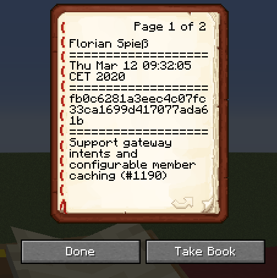
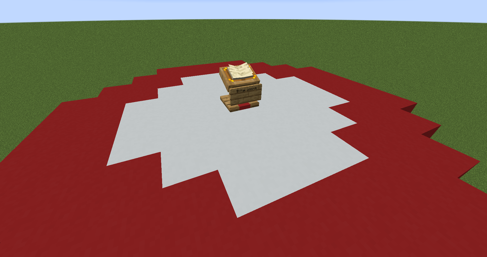
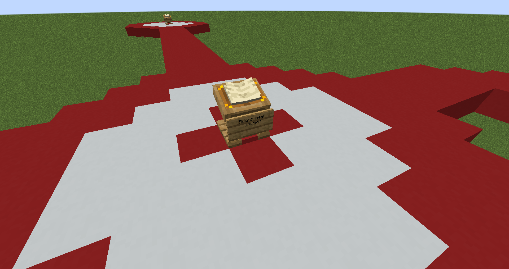
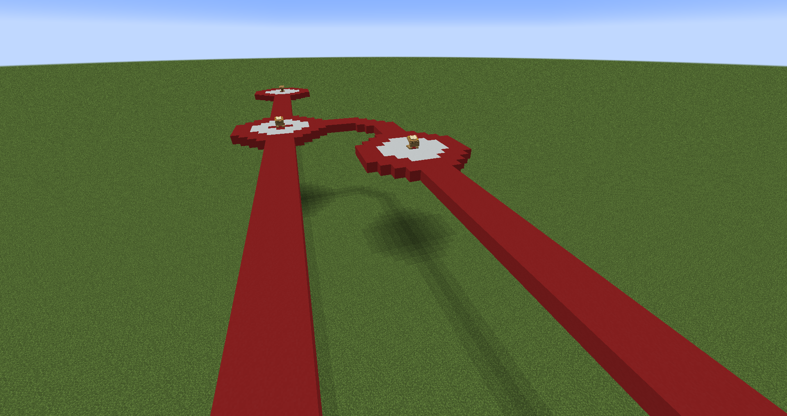

# GitCraft, Visualisation d'un arbre Git dans le jeu Minecraft

## Présentation
GitCraft a pour but d'offrir un aperçu dans le jeu Minecraft d'un repository Git choisi lors de la création du monde
GitCraft parcours les branches du repo choisi pour générer les branches dans un monde et afficher sous forme de blocks, panneaux, et livre sur des Lectern les informations de chaque commit du repository

## Représentation prévue des éléments Git
GitCraft utilisera un code visuel simple pour représenter un repository Git

Chaque commit sera représenté par un cercle avec un Lectern, contenant un livre qui indique l'auteur du commit, la date de celui-ci, le hash, ainsi que le message long

Le lectern possèdera un panneau contenant la description courte du commit en question

Les commits correspondant à une création de branche ou à un merge serons représentés par un cercle au centre coloré

Un arbre Git rassemblera tout ces éléments pour représenter un répository complet, si possible avec de multiples branches

## Installation et utilisation
Pour installer le mod, télécharger et installer MinecraftForge pour Minecraft 1.18.1, sur une installation de Minecraft
Déplacer ensuite le fichier gitcraft-1.0.jar dans le dossier mods de votre installation (créer ce dossier s’il n’existe pas)
Lors de la création d’un monde, changer le type de monde pour ‘GitCraft’, et insérez l’URL d’un repo Git à visualiser

