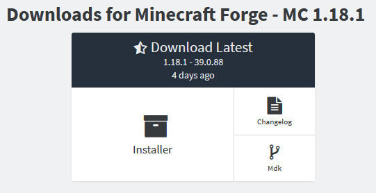
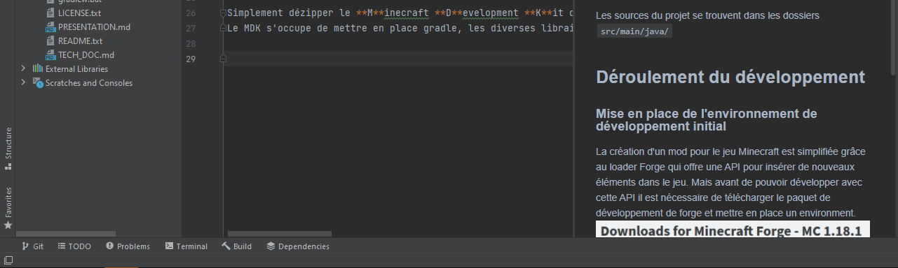
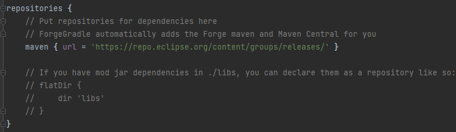
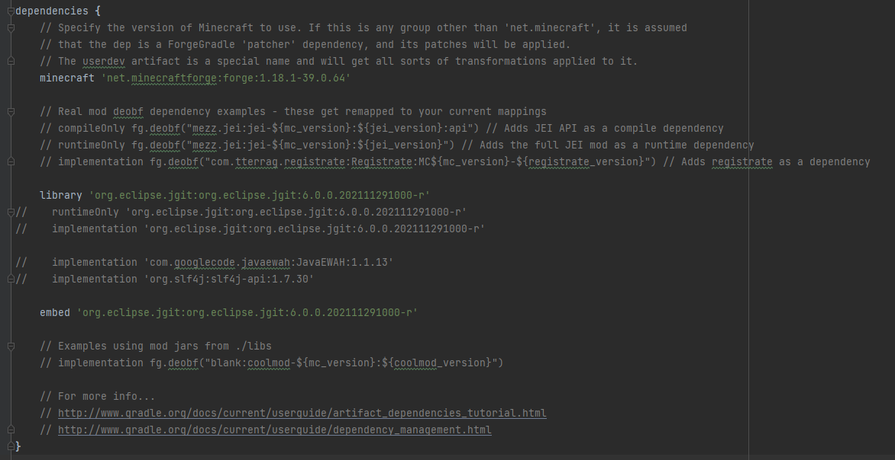
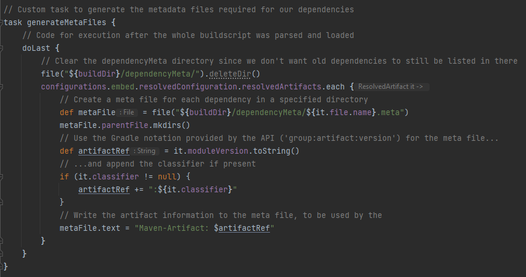
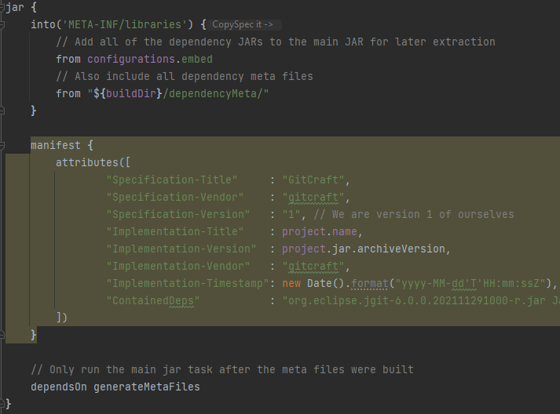
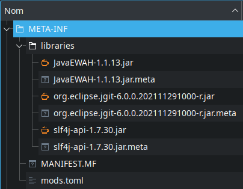
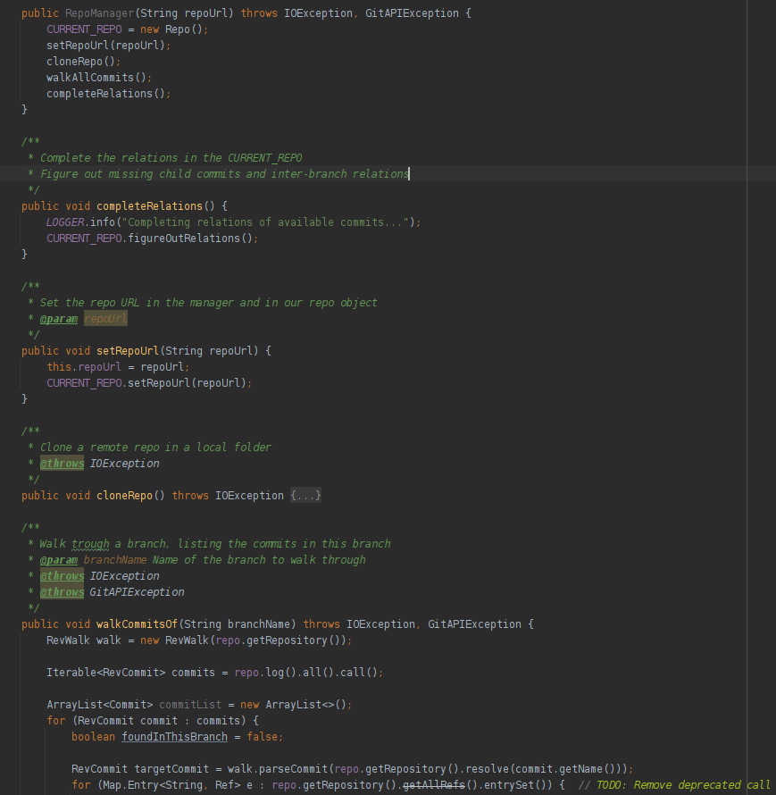
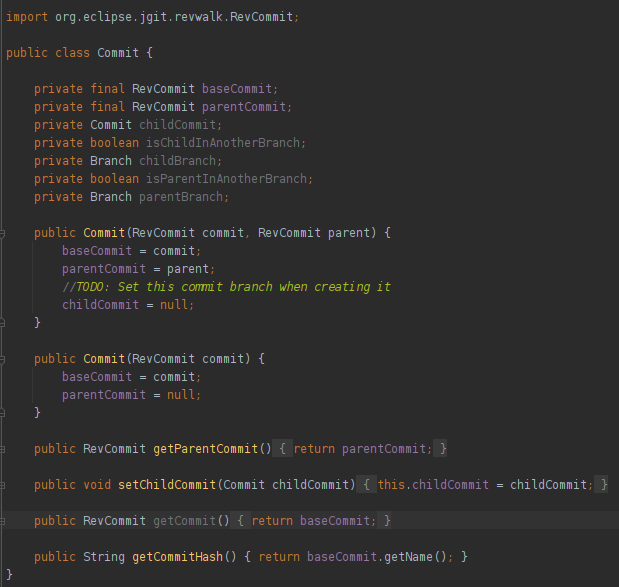

# Documentation technique de GitCraft

## Sommaire
> - Ouverture du projet pour le développement
>   - Requirements
>   - Modification du code
> - Déroulement du développement
> - - Mise en place de l'environnement de développement initial
> - - Ajout des librairies
> - Structure du projet
> - - Initialisation
> - - Interfaçage avec JGit
> - - Création d'un arbre personnalisé
> - Bloquants pendant la réalisation du projet
> - - Lors de la recherche
> - - Lors du développement
> - Pour la suite

## Ouverture du projet

### Requirements

- Un Java Development Kit version 17 minimum (OpenJDK 17 par exemple)
- Un IDE Java (Eclipse ou Intellij Idea, Intellij Idea est recommandé)

### Modification du code

Ouvrir le projet avec votre IDE de choix, lancer la commande `gradlew build` et laisser la commande se terminer

En fonction de votre IDE, lancer soit un `gradlew genEclipseRuns`, soit un `gradlew genIntellijRuns` pour générer automatiquement les tâches de lancements de l'environnement de développement

Les sources du projet se trouvent dans les dossiers `src/main/java/`

## Déroulement du développement

### Mise en place de l'environnement de développement initial

La création d'un mod pour le jeu Minecraft est simplifiée grâce au loader Forge qui offre une API pour insérer de nouveaux éléments dans le jeu.
Mais avant de pouvoir développer avec cette API il est nécessaire de télécharger le paquet de développement de forge et mettre en place un environment.

Simplement dézipper le **M**inecraft **D**evelopment **K**it dans un dossier et lancer mon IDE à l'intérieur de celui-ci suffit à mettre en place un début d'environnement.
Le MDK s'occupe de mettre en place gradle, les diverses librairies par défaut de Forge, et de télécharger les assets de Minecraft

### Ajout des librairies
Dans notre cas, nous utilisons la librairie JGit. Elle peut être ajoutée dans le fichier `build.gradle`, en rajoutant le repo de JGit dans un tag `repositories {}`, et en indiquant `library` et `embed` dans le tag `dependencies {}`.
La librairie JGit se trouve sur le repository Maven de Eclipse, il doit donc être ajouté avant l'inclusion de la librairie, et il faut préciser la version de la librairie nécessaire (on ne peut pas choisir une version `latest`)

Par défaut les librairies ne sont pas incluses à la compilation, et à l'exportation du code, il est donc nécessaire de créer une tâche gradle supplémentaire à appeler.

Pour la génération du .jar, et pour indiquer des informations supplémentaires pour le développement, une catégorie "jar" existe, où j'ai préciser des metadata. Celles-ci sont inscrites dans le dossier META-INF de celui-ci, et permettent aussi d'indiquer la présence de librairies, qui sont inclues dans ce dossier.

## Structure
Pour qu'un mod puisse fonctionner correctement, une structure de code est recommandée, et générée par défaut dans le projet d'exemple fourni avec le MDK. Quelques conventions, non-officielles mais très répandues dans la communauté de moddeurs, sont aussi à respecter plus ou moins.

### Initialisation
L'initialisation d'un mod se divise en plusieurs phases :
- Le setup, la préparation du mod, enregistrement des blocks, objets, monstres, dimensions... Et ajout de ceux-ci dans les registres du jeu
- Les setup de Side, des préparations du mod qui sont exécutées uniquement du côté Client ou du côté Serveur
- L'IMC Enqueue, qui permet d'envoyer des messages inter-mods, permettant des intégrations avec d'autres mods
- L'IMC Process, la réception des messages envoyés par l'IMC Enqueue

Toutes ces phases sont appelées en parallèle entre chaque mod chargés par Forge. [Plus d'information sur la documentation](https://mcforge.readthedocs.io/en/latest/conventions/loadstages/).

### Interfaçage avec JGit
La librairie JGit permet d'effectuer *presque* toutes les commandes disponibles avec une CLI Git, mais manque de fonctionnalité de traitement des repository, branches et commits (ex : Impossible de parcourir les commits d'une branche). Pour me faciliter la tâche dans le futur, j'ai créer une série de fonctions pour gérer et manipuler un ou plusieurs repository, une classe qui me permet :
- D'instancier un nouveau repo
- Définir l'url de clone de celui-ci
- Cloner le repo
- Parcourir les commits d'une branche
- Parcourir les commits de toute les branches

*Extrait de RepoManager, ma classe de gestion*

Parcourir une branche, ou l'ensemble des branches, les rajoutent aussi à l'arbre Git personnalisé qui est instancié en même temps que la classe de gestion.

### Création d'un arbre personnalisé
J'ai décidé de créer une représentation d'un arbre Git, de manière à parcourir un repository plus facilement qu'avec JGit. Ainsi, un repository avec ma structure, est une collection d'objets Branche, qui eux-mêmes sont des collections d'objets Commit.

Chacun de ces objets possède un certain nombre d'accesseurs permettant de les manipuler et d'insérer de nouvelles informations dans ceux-ci, par exemple rajouter le commit parent ou enfant sur un commit, insérer un nouveau commit dans une branche...

*La classe commit, ici en exemple, qui est relativement simple, mais qui est la base de l'arbre*

## Bloquants pendant la réalisation du projet
Plusieurs points bloquants on ralenti le développement de ce projet, autant lors de la recherche que lors du développement de la solution.

### Lors de la recherche
L'un des plus gros point bloquant de ma recherche fut le manque d'information sur l'incorporation de librairies dans un projet Minecraft Forge. En effet, de nombreux posts, existent pour incorporer des **mods** en tant que librairie, mais pas pour des librairies Java standard. J'ai donc été obligé d'expérimenter pendant un long moment avec plusieurs configurations, souvent n'étant plus à jour pour la version du MDK que j'utilisais. Une erreur de ma part a aussi été de ne pas m'avancer pour demander de l'aide dans mes recherches sur ce problème.

Le second point bloquant était la documentation de [JGit](https://www.eclipse.org/jgit/documentation/) et de [Forge](https://mcforge.readthedocs.io/en/latest/) qui étaient toutes deux relativement floues.

La documentation JGit était cachée sous la catégorie "User guide", et dans la partie API de cet User Guide. Plusieurs fonctions et types de la librairies JGit sont expliqués, mais beaucoup sont manquant, et de nombreux cas de figure ne sont pas traités (Beaucoup de sous-arguments de commandes ne sont pas expliqués ni détaillés).

La documentation Forge est bien fournie, mais aussi incomplète. Elle est ainsi à cause du fait que les versions de Minecraft sont nombreuses et sortent rapidement, et donc la documentation doit être réécrite pour chaque version considérée comme LTS actuellement. De ce fait, il est courant de devoir chercher des informations qui ne sont pas à jour dans la documentation, sur des précédentes versions de celle-ci, qui sont en plus caché et uniquement accessible par manipulation de l'URL. (ex : Accès à la documentation de la [1.12.x](https://mcforge.readthedocs.io/en/1.12.x/), non disponible sur la version "latest" de la documentation)

Enfin, les forums discutant de JGit furent d'une grande aide, au contraire de ceux discutant de Forge. En effet, [même si Forge possèdent ses propres forums](https://forums.minecraftforge.net/), il n'en reste pas moins que beaucoup de sujets discutés sur ceux-ci sont pour d'anciennes versions de forge, voir ne parlent pas des problèmes abordés sur ce projet.

### Lors du développement
Comme discuté précédemment, l'ajout des librairies dans un projet Minecraft fut un point très problèmatique, car peu documenté. Les erreurs de mon IDE et du MDK n'aidais que très peu à la résolution de mes problèmes. De plus, pour JGit, j'ai dû manuellement corriger le lien vers le repository Maven, car celui proposé sur le site de JGit était incorrect pour un projet gradle.

JGit a aussi été très compliquer à utiliser au démarrage du projet, car lent pour effectuer les actions (clonage, parcours des commits, toute deux des opérations très longues) et peu clair sur le type des informations renvoyée par la librairie (ex: `refs/remotes/origin/HEAD` correspond à la branche HEAD du repo, en ligne, retour que je ne pensais pas recevoir en demandant le *nom* de la branche à JGit)
La création d'un arbre personnalisé après le clonage du repository fut d'ailleurs ma solution pour rendre l'utilisation de cette librairie plus facile dans mon cas.

L'export du mod ne fonctionne pour l'instant pas, bien que les librairies externes nécessaires sont inclues dans le Jar généré, et que la structure de celui-ci correspond à la documentation trouvée. Il est donc uniquement possible de lancer le mod dans un environnement de développement pour l'instant.

## Pour la suite
Ce projet étant largement incomplet, il est fort probable que je le poursuive l'année prochaine dans mes futurs cours d'expertise.

Au départ, ce projet était prévu pour être divisé en 2 parties:
- La récupération d'un repository Git choisi
- La génération d'un monde depuis les données réordonnées

La première partie de ce projet étant réalisée, l'année prochaine serais dédiée à la génération d'un monde. Cette année m'a permis d'appréhender la structure des repo git, le système de commits et de branches. L'année prochaine me permettra d'expérimenter avec des espaces en 3D et écrans en 2D. J'ai déjà effectué des recherches pour me renseigner sur la génération de monde et le système de génération présent dans le jeu (voir les classes dans `worldgen`), qui utilise de nombreuses formules mathématiques dont je pourrais m'inspirer, ainsi que le système d'interface du jeu (voir les classes dans `common\container` et `client\gui`).